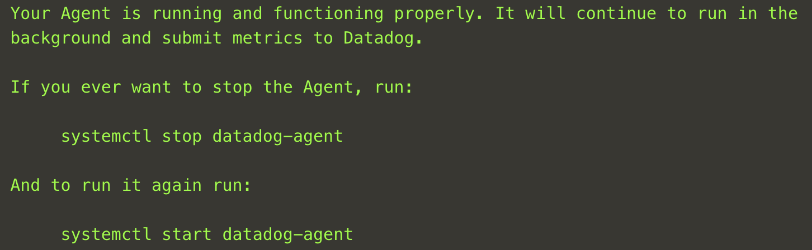

1. If you are not already logged in, login to <a href="https://app.datadoghq.com" target="_datadog">your Datadog account</a>.
2. Now visit the <a href="https://app.datadoghq.com/account/settings#agent" target="_datadog">Integrations > Agent</a> page and click on Ubuntu. Copy the full, easy one-step install command to install the agent. Paste the command into the terminal and press Enter.
3. It should take about a minute to fully install and when complete you will see something like this:
    
4. To verify that everything is running the way it should, run the status command: `datadog-agent status`{{execute}}.
5. Scroll up and review what is shown. Notice that the last 4 characters of your API Key is listed. Also notice that the Logs Agent is not running. Let's change that.
6. Open the `datadog-agent/datadog.yaml`{{open}} file in the editor to the right and find the line with `logs_enabled`. (You can use CTRL-F in Windows/Linux, or Command-F in macOS to search for text in the editor.) Set it to `true` and uncomment the line. The editor will automatically save your changes.
   *Note that the **datadog-agent** directory under **lab** is a symbolic link to **/etc/datadog-agent** so that it shows up in the editor*
7. Run `systemctl restart datadog-agent`{{execute}} to restart the agent and then `datadog-agent status`{{execute}} to verify the status. 
    *Notice that the section for the Logs Agent no longer says that the **Logs agent is not running**.*
8. If running the **status** command results in an error, you should see the line that the parser got up to. Remember that spacing in a YAML file is very important. All the commented lines start with a hash and a space. So to uncomment, remove the hash and the space after the hash.
9.  Using that knowledge, uncomment **logs_config** and **container_collect_all**, changing that last one from `false` to `true`.
10. Restart the agent again, and run the status command again.
11. Scroll down and find the corresponding settings for APM. See if you can enable it. 
12. When you are done with this section, run `grademe`{{execute T1}} in the first terminal to indicate that you are done and to grade your progress. You will not receive any credit until you run **grademe**. Then click the **Continue** button.
