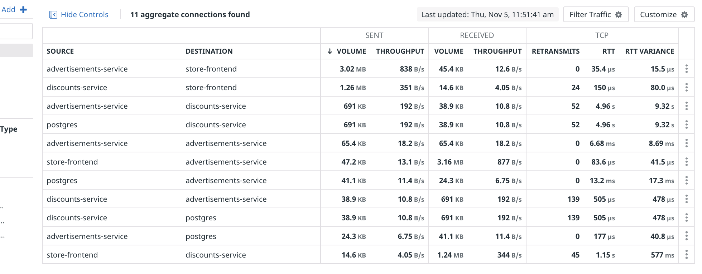
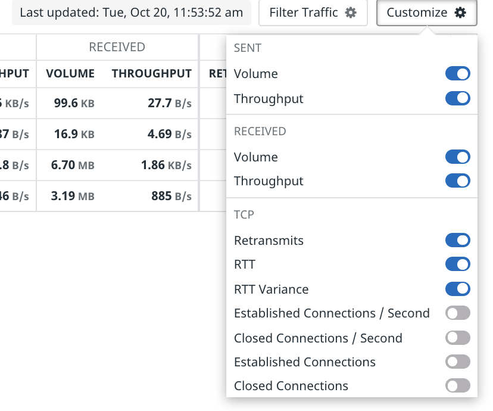
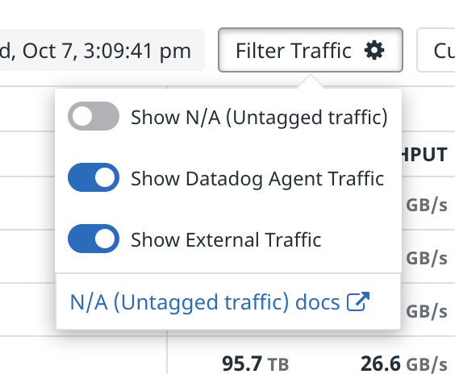
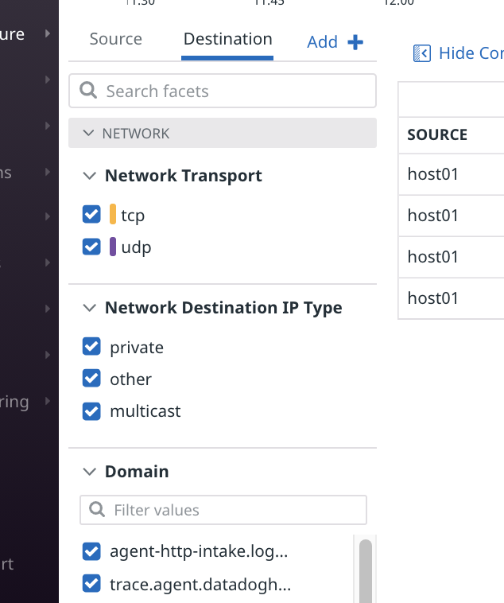
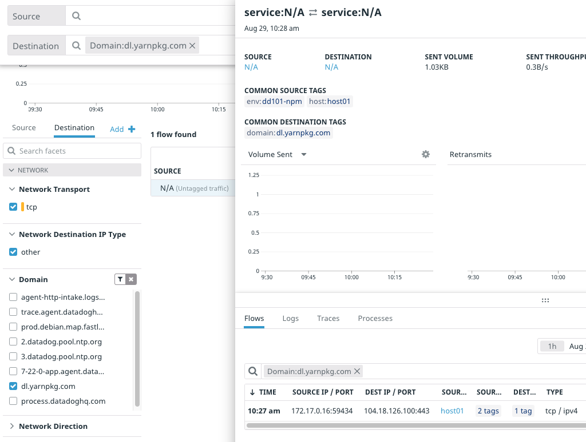
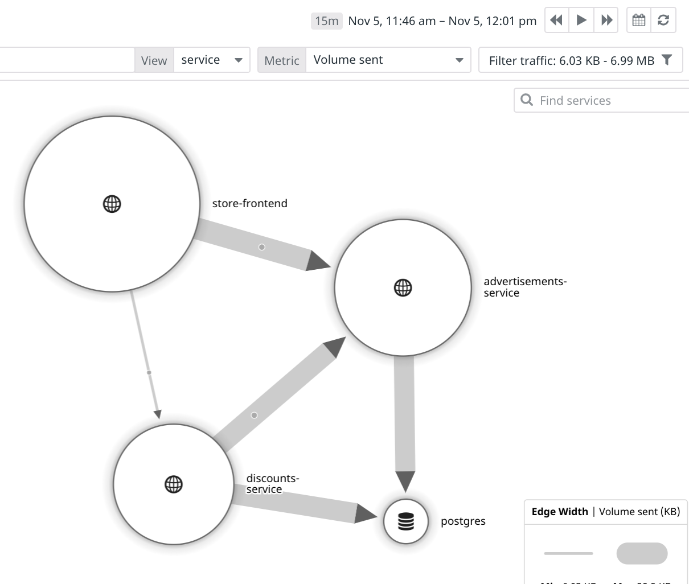
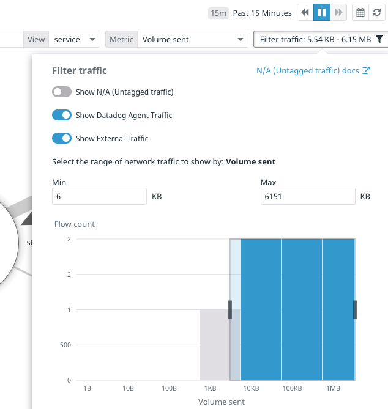

# Explore the Application

Once you see "Provisioning Complete" in the terminal, click the **Storedog** tab to the right of the IDE tab. This will open the Storedog Home page in a new browser window. 

The Home page will take a long time to load. It may even cause error messages, such as `Net::OpenTimeout in Spree::HomeController#index`. These are symptoms of a problem that NPM will help you troubleshoot later.

If you get impatient, you can bypass the Home page by opening the shop's [Categories page](https://[[HOST_SUBDOMAIN]]-3000-[[KATACODA_HOST]].environments.katacoda.com/t/categories), and then navigate from there.

Click around to get familiar with this e-commerce shop. Feel free to add items to your shopping cart and treat it like a real online store.

Since you started this lab, a background process has been automatically making requests to the Storedog app. Between this traffic and the traffic you created while clicking around Storedog, you should have a good amount of network traffic to look at in the Datadog App.

# Observe the Network Metrics
Log in the the [Datadog App](https://app.datadoghq.com/) using the same email address you are using for the Learning Center.

Before you dig in to the network metrics, Navigate to **APM > Traces** to ensure that the Datadog agent is sending data to Datadog. Make sure that the search field is filtering `Env:dd101-npm`. You should see a steady stream of traces resulting from the traffic generated by the lab background process.

If you do not see traces from Storedog services such as `store-frontend`, `advertisements-service`, or `postgres`, make sure you're in the correct organization. You can choose your organization by hovering over the **Account** menu item at the end of the Global Nav. Your Learning center organization will look like &lt;First name&gt; &lt;Last name&gt;:LMS:&lt;last 3 characters of your API key&gt;. For example: Cameron Howe:LMS.2ab.

## Network Page
Navigate to **Infrastructure > Network** using the Global Nav. You will probably see the Discover Network Performance Monitoring introductory screen. This page is displayed until the first NPM data is processed by Datadog, which can take up to 15 minutes. Note that *you should not refresh this page* to see if NPM data has become available; click on the **Infrastructure > Network** menu item to check for updates.

You might enjoy reading the Datadog [documentation about the network page](https://docs.datadoghq.com/network_performance_monitoring/network_page/) while you wait.

Once Datadog has processed NPM data, this page will display network *flows* that Datadog has detected between the application services. A flow is a network connection between any two tagged objects--from services to availability zones, or from Kubernetes pods to security groups. This is what the flow table for the Storedog application might look like:

For the Storedog application, you should see many flows between `advertisements-service`, `store-frontend`, `discounts-service`, and `postgres`. Each flow represents the network communication among these services where one is the Source, and another is the Destination. 

To see your table formatted like the above screenshot, make sure that the **Source** and **Destination** fields at the top of the page are filtering by `Env:dd101-npm`, and that the **Group by** fields are set to `service`. Then toggle the appropriate columns using the **Customize** menu above the network flows table: 

*Note: If `service` is not an option in the **Group by** fields, give Datadog some more time to process networking data.*

You may see flows where the source and destination are **N/A**. This represents traffic to or from an "untagged" resource, which is a client or server that is not running the Datadog Agent. In this case, this includes the lab background process generating traffic on the Docker host and your Storedog browser activity routed through the lab network. You can hide or display untagged traffic using the **Show N/A (Untagged traffic)** toggle in the **Filter Traffic** settings menu.

NPM automatically indexes a broad range of network traffic details, as exhibited by the facet panel to the left of the network flows table. Notice that facets are grouped by **Source** and **Destination**, which are selectable by the tabs at the top of the facets panel:

Spend some time familiarizing yourself with these facets. If you select facets that display no results in the network flows table, it is likely that the associated traffic is untagged, and **Show N/A (Untagged traffic)** is toggled off in the **Filter Traffic** settings menu. Toggle it back on to show untagged traffic.

A notable facet is **Domains**. Select the **Destination** facet panel tab and expand the **Domain** facet group. You'll see all the domain names that NPM was able to resolve during the current time period. If you click on one of the domains, the flow table will filter the related flows to that domain name. You can then click on the flow to see details about that flow.

## Network Map
To visualize network flows, navigate to **Infrastructure > Network Map**. Select **service** from the **View** menu next to the search field up top.

This is a diagram of the same flows on the network page, where each service's size is scaled relative to the volume of network traffic it has sent. The connections between each service are also scaled to indicate what proportion of that volume was sent to each destination. Hover over each service to see more detailed network information.

Here's what the network map for the Storedog application might look like, with untagged (N/A) traffic hidden:

You can choose other metrics by which to scale the diagram using the **Metric** field in the upper-right hand corner. Select some other metrics to see how they affect the diagram, and what that diagram tells you about the application.

You can filter traffic on the network map by clicking the filter button in the upper-right corner. In addition to filtering based on traffic type, you can also set the range of the chosen metric that is displayed.

In the next step, you'll investigate the slow Storedog Home page using the network page.

