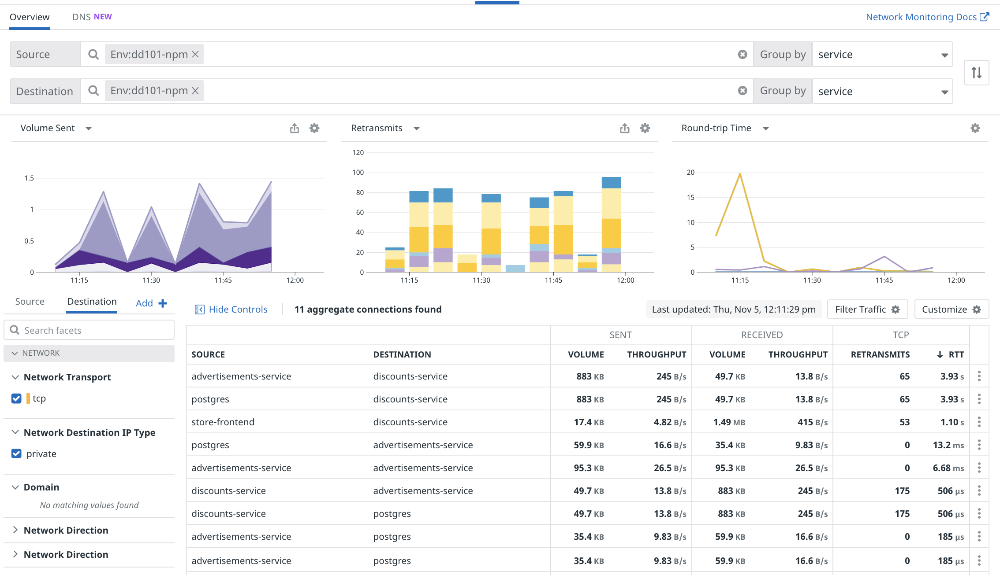
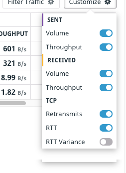
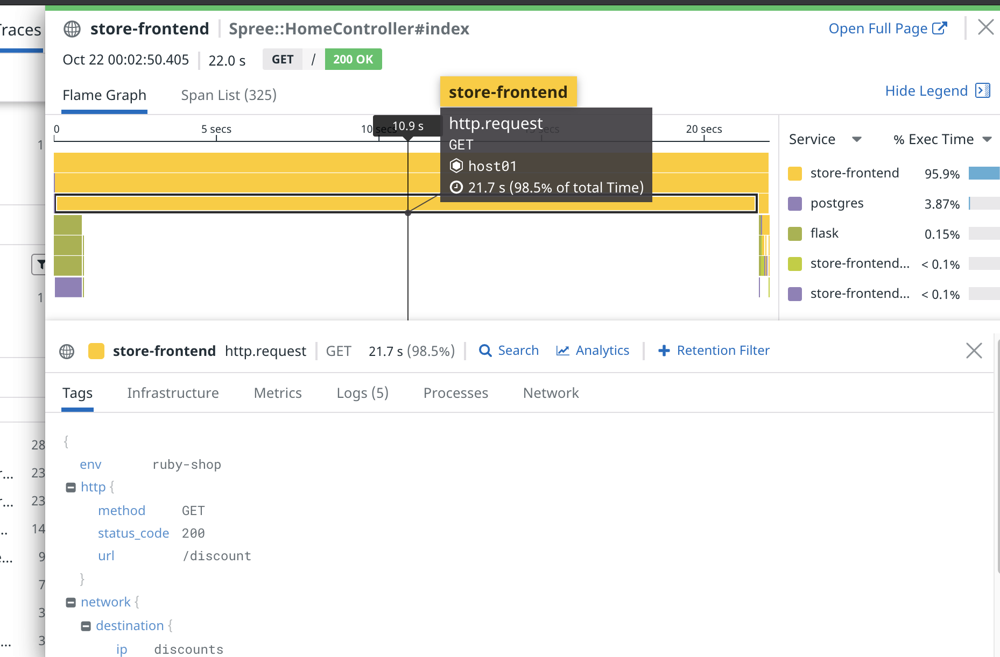

The Storedog Home page is often slow to respond, might display errors, or might not respond at all. There could be a problem in the Storedog code, or the system resources that it's using. It could also be a problem with a service that it depends upon, or the network connection between them. Because this lab is about Network Performance Monitoring, you can start troubleshooting by looking at the Datadog network page. 

Yours should look similar to this:

A couple of issues are readily apparent in the two graphs on the right: A number Retransmits, and some unusually long Round-trip Times.

Retransmits represent detected failed packets that are retransmitted to ensure delivery, measured in the count of retransmits from the source. You can hover over the bars of this graph to see the number of retransmits and the flows in which they occurred.

Round-trip time is a proxy for latency, measured as the time between a TCP frame being sent and acknowledged. Here too, you can hover over the points of the graph to see the round-trip time values and the flows in which they occurred.

The numbers of **Retransmits** by service are displayed in the flow table, along with **Volume Sent** and average **Round-trip Time**. If you don't see these columns, enable them using the **Customize** menu at the top-right of the table: 

Click the **RTT** column heading of the flow table to sort by round-trip time in descending order. Now do the same with the **Retransmits** column. You should see that most of the largest numbers involve the `discounts-service`.

NPM links to Application Performance Monitoring (APM) so you can look at the code traces associated with network flows. This is useful to dig deeper into applications when you're investigating interesting network metrics.  

To look at application traces associated with retransmits, click on one of the flows that has a high number of retransmits. This will reveal the flow details panel. Click on the tallest **Retransmits** bar and select **View related traces**. This will open the APM Traces page for the time period in which the retransmits occurred.

Scroll through the traces and look for errors or unusually long **Duration** values. You are likely to home in on `Spree::HomeController#index` as a frequent problem. Click on a slow trace to look at the spans. Here's an example:

Looking at these spans, it's clear that the Storedog `Spree:HomeController#index` spent a shocking amount of time making  a `GET` request to the `discounts` service. Because there are no application errors or other spans during this period, it's fair to conclude that the request was delayed by something external to the application, like the network. 

Spend some time inspecting flows on the network page and drilling down into APM traces to find other slow traces.

With this information, you can proceed to investigate, diagnose, and fix the network connection between the `store-frontend` and `discounts` services. In this lab, that's very easy to do. In the Terminal, run the following command: `fixnetwork`{{execute}}

Now look at the Datadog network page and watch the number of retransmits and the average round-trip times taper downward. This may take 5 minutes or more.

Nice work! Now you can reward yourself with a passing grade by typing `grademe`{{execute}} in the terminal.

