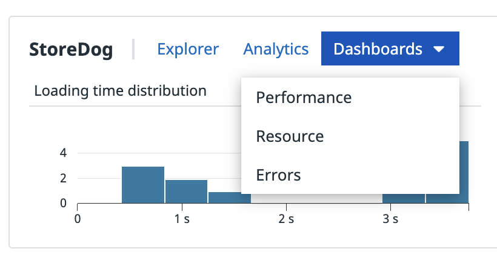

1. After a browsing Storedog and waiting a few seconds, you should start to see data populating in the [RUM Application List](https://app.datadoghq.com/rum/list)
2. By clicking on the **Dashboards** dropdown, you can view the dashboards Datadog automatically creates for RUM Applications:
    
3. Take a look at the **Performance** dashboard. The performance overview dashboard offers a bird’s-eye view of RUM applications. It is separated into several sections:
    1. Performance metrics: For all views, four browser metrics are highlighted: Initial Loading Time, First Contentful Paint (FCP), and Time To First Byte (TTFB).
    2. Errors: Shows the proportion of pages with errors and most visited pages with errors.
    3. Resources: Shows the resources loaded grouped by type (JS, CSS, etc) and the resource count for most visited pages.
    4. Actions: Shows the user actions grouped by type and the user action count for most visited pages.
4. If you go back to the [RUM Application List](https://app.datadoghq.com/rum/list), you can also check out the **Resource** and **Errors** dashboards to view more details for those. After you have seen these, we'll move on to look at the RUM Explorer.