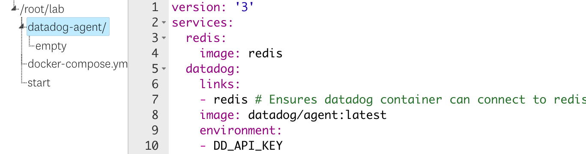

2. Open the file `docker-compose.yml` in the editor to the right. 
3. Notice that only a single Redis image is in the file, but we want to add the Datadog agent. Datadog will run as a sidecar container on our host. 
4. Copy the following text, then paste it into the file.

   <pre class="file" data-target="clipboard">
   datadog:
       links:
       - redis # Ensures datadog container can connect to redis container
       image: datadog/agent:latest
       environment:
       - DD_API_KEY
       - DD_HOSTNAME=dockerhost
       volumes:
       - /var/run/docker.sock:/var/run/docker.sock:ro
       - /proc/:/host/proc/:ro
       - /sys/fs/cgroup:/host/sys/fs/cgroup:ro
   </pre> 

   You can see the indent levels for this section in this image: 
5. Ensure you are in the `/root/lab` directory.
6. Run `docker-compose up`{{execute}} in the terminal to start.
7. Switch over to the Terminal 2, ensure you are in the `/root/lab` directory, and run the Datadog status command: `docker-compose exec datadog agent status`{{execute T2}}
8. As you can see, the Datadog agent is running but we have the same issues we saw in the previous step with APM and Logs not enabled. But instead of using a configuration file, we use environment variables to do this.
9. In the editor, add the following environment variables to the Datadog service:
        DD_APM_ENABLED=true
        DD_LOGS_ENABLED=true

   The environment variables will have the same format as the DD_HOSTNAME env var.

10. In the first terminal tab, press CTRL-C to stop docker-compose and then run docker-compose up again to restart it.
11. In the second terminal, run the status command and see if you have successfully enabled them.
12. Review the available environment variables in <a href="https://docs.datadoghq.com/agent/docker/?tab=standard#overview" target="_datadog">the documentation</a>
13. When you are done with this section, run the `finish`{{execute}} command and then click the **Continue** button.

It's important to note that when working with containers, you only install the agent within the container environment. You don't need to install it on the host as well.
